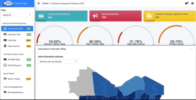
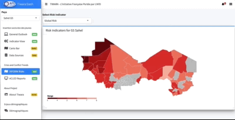

# Tiwara: Sahel Initiative portée par L'AFD  

#### General Preview

#### Risks, Crisis and Conflicts 

 

### Credit

We make use of [bs4Dash](https://github.com/DivadNojnarg/bs4Dash), a bootstrap 4 shinydashboard using AdminLTE3.

#### Issues

Issues are listed [here](https://github.com/brainy749/Tiwara/issues).

#### TODO

* Data Pipelines: direct connection with API's and datasets 
* Optimization of the Code for Speed
* Improve Reactivity of Shiny Components

See a preview [here](https://afdshiny.shinyapps.io/Tiwara/).

 
